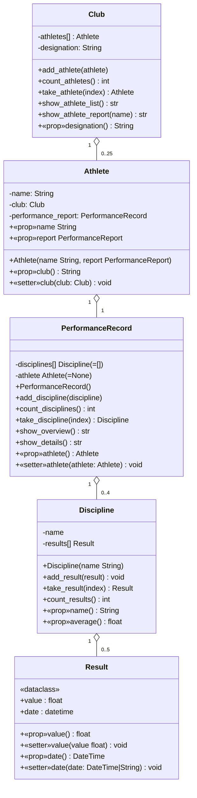

# LU09.A02 – Sportverein

*Modul M320 – Objektorientiert programmieren*

## Lernziele

Studierende sollen in einer komplexen Anwendung selbständig:

- Klassen erstellen
- Ein- und zweiseitige Beziehungen sowie Mehrfachbeziehungen implementieren
- Den nötigen Ablauf selbst festlegen
- Geforderte Ausgaben erzeugen

## Aufgabenstellung

Es ist eine einfache Vereinsverwaltung für einen Leichtathletikverein gemäss dem untenstehenden Klassendiagramm zu implementieren, wobei Wissen zu Beziehungen und Referenzzuweisung genutzt wird.

Ein `Club` verwaltet seine `Athlete`n. Jede `Athlete`-Person besitzt genau einen `PerformanceRecord` (Leistungsausweis), der mehrere `Discipline`n (Disziplinen, z. B. Sprint) enthält. Jede `Discipline` wiederum enthält mehrere `Result`e (Resultate) mit Wert und Datum.

## Klassendiagramm



## Klassenstruktur und Anforderungen

### Club

**Konstruktor**: `designation` übernehmen, `_athletes[]` als leere Liste initialisieren

**add_athlete**:
- Maximum 25 Athleten
- setzt bei jedem Athleten die Rückreferenz `club`
- `OverflowError` bei Überschreitung

**count_athletes**: Anzahl zurückgeben

**take_athlete(index)**:
- Athlet bei Index liefern
- `IndexError` bei ungültigem Index

**show_athlete_list**: Namen aller Athleten ausgeben (einer pro Zeile)

**show_athlete_report(name)**: Leistungsausweis mit allen Disziplinen und deren Schnitt; `"Athlet <name> nicht gefunden"`, falls kein Athlet mit diesem Namen existiert

### Athlete

**Konstruktor**: `name` und optional `record` (Default: ein neuer, leerer `PerformanceRecord`); setzt beim übergebenen bzw. erzeugten `PerformanceRecord` die Rückreferenz `athlete`; `club` ist zu Beginn `None`

**show_report**: Referenz auf das `PerformanceRecord`-Objekt zurückgeben

### PerformanceRecord

**Konstruktor**: `_disciplines[]` als leere Liste initialisieren, `athlete` zu Beginn `None`

**add_discipline**:
- Maximum 4 Disziplinen
- `OverflowError` bei Überschreitung

**take_discipline(index)**: Disziplin bei Index liefern, `IndexError` bei ungültigem Index

**count_disciplines**: Anzahl zurückgeben

**show_overview**: Leistungsausweis mit allen Disziplinen und deren Notenschnitt (analog zum "Zeugnis" der Schulverwaltung)

**show_details**: alle Disziplinen mit den einzelnen Resultaten (Datum + Wert) und dem jeweiligen Schnitt

### Discipline

**Konstruktor**: `name` übernehmen, `_results[]` als leere Liste initialisieren

**add_result**:
- Maximum 5 Resultate
- `OverflowError` bei Überschreitung

**take_result(index)**: Resultat bei Index liefern, `IndexError` bei ungültigem Index

**count_results**: Anzahl Resultate zurückgeben

**average**: Durchschnitt aller Resultate berechnen (0.00, falls leer)

### Result

Implementiert als `@dataclass`

**Konstruktor**: `value` und `date` initialisieren

**\_\_post_init\_\_**: Zusicherung für `value` (gültige Zahl, Bereichsprüfung 0.0–10.0), `ValueError` bei ungültigem Wert, `TypeError` bei nicht-numerischem Wert

**date.setter**:
- `DateTime`-Objekt direkt speichern
- String im Format `(d)d.(m)m.(yy)yy` in `DateTime` konvertieren
- Alles andere (inkl. `None`): aktueller Zeitstempel

## Ausgabeformat (main)

```
Nina
Jon
Aylin

----
Leistungsausweis für: Nina
	  Sprint      :  8.25
	  Weitsprung  :  7.25
	  Kugelstoss  :  6.75

----
Leistungsausweis für: Jon
	  Sprint      :  6.75
	  Weitsprung  :  8.25
	  Kugelstoss  :  7.75

----
Leistungsausweis für: Aylin
	  Sprint      :  8.75
	  Weitsprung  :  7.75
	  Kugelstoss  :  8.75

----
Athlet Theo nicht gefunden
  Sprint (Schnitt: 8.75)
	  01.01.2011  :  9.00
	  02.02.2022  :  8.50
  Weitsprung (Schnitt: 7.75)
	  03.03.2033  :  7.50
	  04.04.2044  :  8.00
  Kugelstoss (Schnitt: 8.75)
	  05.05.2055  :  9.00
	  06.06.2066  :  8.50
```

## Vorgehen

1. Klassenskelett mit allen Methoden aufbauen
2. Klassen ohne Referenzen zuerst implementieren (`Result`, `Discipline`)
3. Dann abhängige Klassen (`PerformanceRecord`, `Athlete`, `Club`)
4. Konstruktoren zuerst
5. Properties und Setter
6. Methoden mit Logik (zunächst hart codierte Rückgabewerte)
7. Jede Klasse mit Unit Tests testen

## Hinweise

- `show_…`-Methoden liefern Strings, kein `print`
- `print` nur in `main()` nutzen
- Tests einzeln ausführen, z. B. `pytest test_result.py`
- Die mitgelieferten Tests sind die Spezifikation – sie dürfen nicht verändert werden

## Abgabe

- Dauer: 4–6 Stunden
- Format: Push ins GitHub Repository
- GitHub Repository (Vorlage): https://github.com/templates-python/m320-lu09-a02-sportverein *(Platzhalter – siehe Hinweis unten)*
- BZZ-Lernende: GitHub Classroom Assignment verwenden

## Lizenz

CC Attribution-Noncommercial-Share Alike 4.0 International
